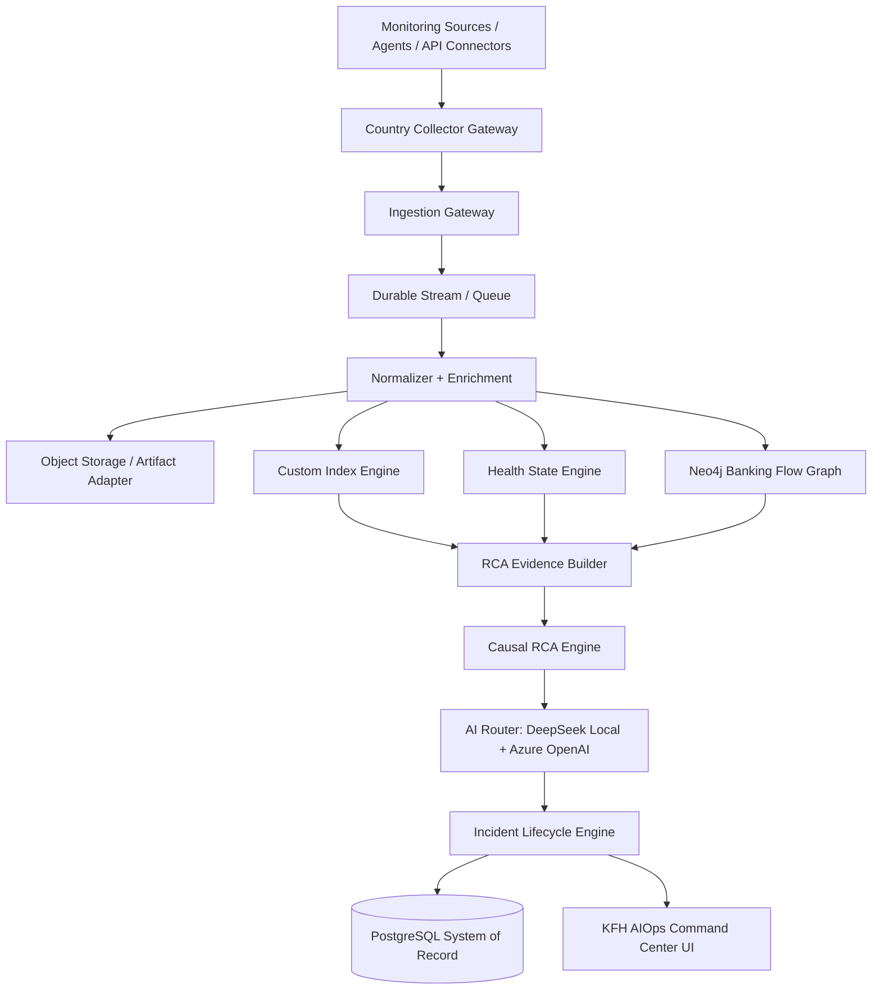

# KFH AIOps — Graphify Knowledge Graph for AI Coding Assistants

> **Purpose:** One consolidated, Graphify-style instruction map for AI coding assistants working on the KFH Causal AIOps Platform / KFH AIOps Command Center.
>
> **Use this first:** Read this document before editing code or docs. It summarizes the project identity, architecture, invariants, module boundaries, source documents, and Definition of Done in a knowledge-graph format that is easier for coding agents to follow.
>
> **Important:** This file is an AI-assistant navigation and instruction layer. Existing source docs remain authoritative for detailed contracts, runbooks, schema, and UI specs. When a task changes one of those areas, update the detailed source doc plus `docs/PROGRESS-*.md`.

---

## 1. Graphify Operating Contract

### 1.1 Instruction precedence

```text
System/developer instructions
  > user-provided repository instructions
  > this knowledge graph
  > detailed source docs
  > inferred patterns from code
```

### 1.2 Core assistant rule

> This platform is **not** an alert grouping system.
> It is a **banking-flow-aware causal AIOps platform** that explains business impact and evidence-backed root cause.

### 1.3 Required before coding

1. Read the always-load files in this order:
   - `.github/copilot-instructions.md`
   - `.github/INDEX.md`
   - `docs/AI_CODING_ASSISTANT_KNOWLEDGE_GRAPH.md`
   - `.github/PROGRESS.md`
   - the active `docs/PROGRESS-*.md` volume
2. Use this Graphify knowledge graph and `.github/INDEX.md` to load only the detailed docs required for the impacted area:
   - Product/architecture/security: `docs/OVERVIEW.md`, `docs/ARCHITECTURE.md`, `docs/SECURITY.md`
   - API changes: `docs/API_CONTRACTS.md`
   - Operational behavior: `docs/RUNBOOKS.md`
   - Database changes: `docs/DATABASE_SCHEMA.md`
   - Backend modules/classes: `docs/BACKEND_MODULES.md`, `docs/SERVICES_CORE.md`, `docs/SERVICES_SUPPORT.md`
   - Frontend pages: `docs/FRONTEND_MODULES.md`, `docs/UI_PAGES.md`
   - Outbox/async: `docs/OUTBOX.md`
3. Identify impacted graph nodes before editing: module/page, data source, table/schema, API contract, RBAC permission, tenant/country/environment scope, audit/outbox need, and operational runbook impact.
4. Enforce platform invariants: OWASP A01-A10, tenant/country isolation, service-layer RBAC, audit for writes, safe logging, SSRF protection, no secrets/PII/raw payloads in logs or prompts, deterministic incident lifecycle, and custom-index-only telemetry search.
5. Plan the files before editing.

### 1.4 Required after coding or docs changes

1. Validate the targeted change with diagnostics, tests, or docs-only checks as appropriate.
2. Update detailed docs when behavior changes.
3. Add or adjust tests for code changes.
4. Append a newest-on-top entry to the active progress file (`docs/PROGRESS-003.md` at the time this file was created).
5. Update `.github/PROGRESS.md` for recent/high-impact work or agent-routing/status changes.
6. Do not include secrets, tokens, raw payloads, or PII in docs, logs, tests, or progress entries.

---

## 2. Knowledge Graph Ontology

### 2.1 Node types

| Node type | Meaning | Examples |
|---|---|---|
| `Product` | Business/product identity | `KFH Causal AIOps Platform` |
| `Principle` | Non-negotiable architecture rule | `EvidenceFirstAI`, `DeterministicLifecycle` |
| `Actor` | Human/operator persona | `NOC Operator`, `Country Admin` |
| `TenantScope` | Tenant/country/environment context | `tenantId`, `KW`, `BH`, `EG`, `PROD` |
| `Component` | Runtime architectural component | `Ingestion Gateway`, `Causal RCA Engine` |
| `Module` | Java/package bounded context | `plugin`, `normalization`, `incident` |
| `DataStore` | Persistence/cache/index technology | `PostgreSQL`, `Neo4j`, `Redis`, `Custom Index Engine`, `Object Storage` |
| `Workflow` | Business/technical flow | `Hourly Scheduled Run`, `On-demand Investigation` |
| `API` | Versioned REST contract | `/api/v1/incidents` |
| `SecurityControl` | OWASP/governance rule | `TenantContext`, `RBAC`, `AuditLog`, `SsrfGuard` |
| `Document` | Detailed source document | `docs/API_CONTRACTS.md` |
| `Status` | Current implementation stage | `Implemented`, `Phase 1 scaffold`, `Planned` |

### 2.2 Relationship types

| Relationship | Meaning |
|---|---|
| `MUST` / `MUST_NOT` | Hard requirement or prohibition |
| `OWNS` | Authoritative ownership of data/behavior |
| `USES` | Component consumes another component/store |
| `WRITES_TO` / `READS_FROM` | Data flow direction |
| `ENFORCES` | Security or validation control |
| `EMITS` | Domain/outbox event production |
| `EXPLAINS` | AI narrative over evidence |
| `REFERENCES` | Source doc or artifact relationship |
| `DEGRADES_TO` | Resilience fallback behavior |

---

## 3. Product Identity Graph

```graphify
(Product:KFH_Causal_AIOps_Platform)
  -[:ALSO_KNOWN_AS]-> (Product:KFH_AIOps_Command_Center)
  -[:SERVES]-> (Actor:NOC_Operator)
  -[:SERVES]-> (Actor:SRE_AppSupport)
  -[:SERVES]-> (Actor:Infra_Team)
  -[:SERVES]-> (Actor:Security_Audit)
  -[:SERVES]-> (Actor:Leadership)
  -[:MUST_ANSWER]-> (Question:Which_Banking_Journey_Is_Impacted)
  -[:MUST_ANSWER]-> (Question:Which_Country_Is_Impacted)
  -[:MUST_ANSWER]-> (Question:Which_Dependency_Failed_First)
  -[:MUST_ANSWER]-> (Question:What_Is_The_Evidence)
  -[:MUST_ANSWER]-> (Question:Open_Monitor_Close_Or_Reopen)
```

### 3.1 Product goals

- Understand the banking flow from customer experience to frontend, backend, database, storage, network, and external dependencies.
- Normalize telemetry into canonical events before indexing, health scoring, graph traversal, RCA, or AI explanation.
- Produce evidence-backed RCA with confidence scoring, timeline, symptoms, excluded causes, impacted journey, and recommended action.
- Keep incident lifecycle deterministic; AI may recommend, but must not decide closure/reopen/suppression.

### 3.2 Product non-goals

- Do not replace monitoring tools; ingest from them through governed connectors/plugins.
- Do not build traditional alert similarity grouping as the primary RCA logic.
- Do not store huge raw logs in PostgreSQL or Neo4j.
- Do not send raw log floods to AI.
- Do not bypass tenant, country, RBAC, audit, or correlation controls.

---

## 4. Architecture Graph



### 4.1 Data ownership graph

```graphify
(PostgreSQL:SystemOfRecord)
  -[:OWNS]-> (Identity_RBAC_Audit)
  -[:OWNS]-> (Connectors_Schedules_Config)
  -[:OWNS]-> (Incidents_Workflow_Status)
  -[:OWNS]-> (RCA_Summaries_Report_Index)
  -[:MUST_NOT_OWN]-> (Huge_Raw_Telemetry)

(Neo4j:RelationshipGraph)
  -[:OWNS]-> (Topology)
  -[:OWNS]-> (Banking_Flow_Graph)
  -[:OWNS]-> (Blast_Radius)
  -[:OWNS]-> (Causal_Path_Traversal)
  -[:MUST_NOT_OWN]-> (Raw_Logs)
  -[:MUST_NOT_OWN]-> (Full_Text_Telemetry_Search)

(Redis:HotCache)
  -[:OWNS]-> (Health_State)
  -[:OWNS]-> (Dashboard_Cache)
  -[:OWNS]-> (Dedup_Windows)
  -[:OWNS]-> (Distributed_Locks)
  -[:MUST_NOT_OWN]-> (System_Of_Record)

(CustomIndexEngine:TelemetrySearch)
  -[:OWNS]-> (Logs_Alerts_Traces_Metrics_Changes_Search)
  -[:MUST_SUPPORT]-> (Time_Partition_Pruning)
  -[:MUST_SUPPORT]-> (Shard_Parallelism)
  -[:MUST_RETURN]-> (Compact_Evidence_Pointers)

(ObjectStorage:RawArchive)
  -[:OWNS]-> (Compressed_Raw_Telemetry)
  -[:OWNS]-> (Evidence_Snapshots)
  -[:OWNS]-> (Large_Artifacts)
```

> Current Phase 1 docs and code may refer to SharePoint as an artifact adapter. Treat SharePoint as one possible object/artifact storage implementation, not as a replacement for the object-storage responsibility.

---

## 5. Non-Negotiable Invariant Graph

```graphify
(Every_API_Request) -[:MUST_INCLUDE]-> (X_Tenant_Id)
(Every_API_Request) -[:MUST_INCLUDE]-> (X_User_Id)
(Every_API_Request) -[:SHOULD_INCLUDE]-> (X_Correlation_Id)
(Country_Data) -[:MUST_BE_SCOPED_BY]-> (CountryCode)
(Physical_Countries) -[:INCLUDE]-> (KW)
(Physical_Countries) -[:INCLUDE]-> (BH)
(Physical_Countries) -[:INCLUDE]-> (EG)
(ALL_Country_Scope) -[:REQUIRES]-> (COUNTRY_GLOBAL_VIEW_or_StarPermission)

(Write_Action) -[:MUST]-> (RBAC_Check)
(Write_Action) -[:MUST]-> (Tenant_Scoped_Lookup)
(Write_Action) -[:MUST]-> (Audit_Log)
(Async_Work) -[:MUST]-> (Outbox_Event)
(External_HTTP_Call) -[:MUST]-> (Timeout_Retry_CircuitBreaker)
(External_URL_Config) -[:MUST]-> (SSRF_Guard)

(AI_Model) -[:MUST_EXPLAIN]-> (Evidence_Pack)
(AI_Model) -[:MUST_NOT_RECEIVE]-> (Raw_Telemetry_Flood)
(AI_Model) -[:MUST_NOT_RECEIVE]-> (Secrets_or_Unnecessary_PII)
(AI_Model) -[:MUST_NOT_DECIDE]-> (Incident_Lifecycle)

(Incident_Lifecycle) -[:MUST_BE]-> (Deterministic)
(Incident_Close) -[:REQUIRES]-> (Healthy_Business_Flow)
(Incident_Close) -[:REQUIRES]-> (Healthy_Root_Cause_Entity)
(Incident_Reopen) -[:REQUIRES]-> (Same_Causal_Path_or_Root_Cause_Returns)
```

---

## 6. Canonical Telemetry Graph

```graphify
(Source_Alert_Log_Metric_Trace_Change)
  -[:COLLECTED_BY]-> (AiOpsConnectorPlugin)
  -[:VALIDATED_BY]-> (Ingestion_Gateway)
  -[:ARCHIVED_AS]-> (RawRef_ObjectStorage)
  -[:NORMALIZED_TO]-> (CanonicalTelemetryEvent)
  -[:ENRICHED_WITH]-> (Business_Journey_App_Service_Owner_Criticality_Topology)
  -[:INDEXED_BY]-> (CustomIndexEngine)
  -[:UPDATES]-> (Redis_Health_State)
  -[:INFORMS]-> (Neo4j_Topology)
  -[:SUPPORTS]-> (Evidence_Pack)
```

### 6.1 Required canonical dimensions

- Identity: `eventId`, `eventType`, `tenantId`, `countryCode`, `environment`, `timestamp`
- Source: `sourceSystem`, `collectorId`, `connectorId`
- Business context: `businessDomain`, `businessJourney`, `applicationId`, `serviceId`
- Resource: `resourceId`, `resourceName`, `resourceType`, `resourceRole`
- State: `severity`, `status`, message/error fields, trace/correlation/transaction IDs
- Search pointers: `rawRef`, `schemaVersion`, metrics and attributes

### 6.2 Plugin rules

- Every external integration is a plugin implementing the connector contract.
- Plugins return normalized telemetry or raw source DTOs for normalization.
- Plugins must not write directly to incidents.
- Plugins must not call AI.
- Plugins must not mutate Neo4j unless they are topology-specific plugins.
- Plugin secrets are encrypted and never returned.
- Plugin execution is audited and records connector run logs.

---

## 7. Module Graph

```graphify
(org.kfh.aiops.platform)
  -[:CONTAINS]-> (security tenant country audit config exception validation observability outbox)

(org.kfh.aiops.plugin)
  -[:CONTAINS]-> (AiOpsConnectorPlugin PluginRegistry ConnectorService ConnectorEndpointGuard ConnectorTlsSupport)
  -[:CURRENTLY_SUPPORTS]-> (BMC_Helix AppDynamics VMware_vROps SCOM EMCO_Ping_Monitor)
  -[:PLANNED_SUPPORTS]-> (SolarWinds BmcHelix Prometheus OracleDb SqlServer PostgreSql F5 Vmware Storage Network OpenTelemetry)

(org.kfh.aiops.normalization)
  -[:OWNS]-> (CanonicalTelemetryEvent Severity NormalizationService EnrichmentService FingerprintService)

(org.kfh.aiops.index)
  -[:OWNS]-> (IndexWriter IndexReader ShardManager Analyzer Tokenizer RetentionService ArchiveService)

(org.kfh.aiops.topology)
  -[:OWNS]-> (TopologyService BlastRadiusService CausalPathService Neo4jAdapters)

(org.kfh.aiops.health)
  -[:OWNS]-> (HealthStateService BaselineService HealthScorer RedisAdapters)

(org.kfh.aiops.rca)
  -[:OWNS]-> (EvidenceBuilder CausalRcaService RcaPromptFactory RcaResult EvidenceItem)

(org.kfh.aiops.ai)
  -[:OWNS]-> (AiRouter DeepSeekClient AzureOpenAiClient AiCostTracker)

(org.kfh.aiops.incident)
  -[:OWNS]-> (IncidentController IncidentService IncidentLifecycleService IncidentStatus IncidentRepository)

(org.kfh.aiops.commandcenter)
  -[:OWNS]-> (Dashboard Alerts Applications Inventory Reports Schedules Static_UI_ReadModel)
```

### 7.1 Current implementation status snapshot

- Phase 1 modular monolith skeleton is in progress.
- Static SPA and `/api/v1/**` scaffold endpoints exist for the Command Center UI.
- Tenant context, country guard, service-layer permission checks, connector persistence, connector TLS options, SSRF guard, and secret encryption are partially implemented.
- Custom index engine, full topology/RCA/AI router/Redis health state remain planned or early scaffolds depending on module.

---

## 8. API Contract Graph

```graphify
(/api/v1/auth/sign-in) -[:RETURNS]-> (Tenant_User_Country_Permissions)
(/api/v1/users) -[:OWNS]-> (Identity_Admin)
(/api/v1/dashboard) -[:OWNS]-> (KPI_Trends_Summary)
(/api/v1/alerts) -[:OWNS]-> (Alert_Explorer_Activity)
(/api/v1/incidents) -[:OWNS]-> (Incident_CRUD_Status_Evidence_Timeline)
(/api/v1/connectors) -[:OWNS]-> (Connector_CRUD_Toggle_Test_Heartbeat_Logs)
(/api/v1/applications) -[:OWNS]-> (Application_Catalog_Health_Inventory)
(/api/v1/inventory) -[:OWNS]-> (Resource_Inventory_Dependencies_Alerts)
(/api/v1/reports) -[:OWNS]-> (Report_Packs_Artifacts_Generation)
(/api/v1/settings) -[:OWNS]-> (Tenant_Scoped_Secret_Safe_Settings)
(/api/v1/audit) -[:OWNS]-> (Country_Aware_Audit_Activity)

(/api/v1/logs/search) -[:PLANNED_FOR]-> (CustomIndex_Search)
(/api/v1/topology) -[:PLANNED_FOR]-> (Neo4j_Topology)
(/api/v1/rca/run) -[:PLANNED_FOR]-> (Evidence_Backed_RCA)
(/api/v1/health) -[:PLANNED_FOR]-> (Redis_Hot_Health_State)
```

### 8.1 API rules

- Public REST endpoints live under `/api/v1`.
- Controllers are thin; services enforce tenant scope, country access, RBAC, audit, and outbox.
- DTOs are separate from entities and outbox payloads.
- List endpoints support pagination and filtering.
- Errors use stable `problem+json`-style codes and include correlation ID.
- Responses must not expose plaintext secrets, raw payload floods, stack traces, or cross-tenant/cross-country data.

---

## 9. PostgreSQL System-of-Record Graph

```graphify
(PostgreSQL)
  -[:HAS_SCHEMA]-> (identity users roles permissions audit_log)
  -[:HAS_SCHEMA]-> (config connectors connector_secrets schedules integration_settings)
  -[:HAS_SCHEMA]-> (cmdb applications services resources business_journeys ownership)
  -[:HAS_SCHEMA]-> (incident incidents incident_status_history incident_evidence incident_groups rca_results)
  -[:HAS_SCHEMA]-> (ops connector_runs connector_run_logs jobs outbox_events)
```

### 9.1 Database rules

- Flyway versioned migrations only: `V{n}__description.sql`.
- Never modify applied migrations.
- Every business table should carry tenant, country where applicable, audit timestamps, and optimistic locking.
- Add indexes for tenant/time, fingerprints, and foreign-key filters.
- Store raw telemetry pointers (`raw_ref`), not huge raw payloads.
- Connector secrets live encrypted in `config.connector_secrets`; controllers must never select or return plaintext secrets.

---

## 10. RCA and Incident Lifecycle Graph

```graphify
(RCA_Candidate)
  -[:SCORED_BY]-> (First_Bad_Timestamp)
  -[:SCORED_BY]-> (Topology_Position)
  -[:SCORED_BY]-> (Severity)
  -[:SCORED_BY]-> (Blast_Radius)
  -[:SCORED_BY]-> (Error_Count)
  -[:SCORED_BY]-> (Metric_Baseline_Deviation)
  -[:SCORED_BY]-> (Log_Evidence)
  -[:SCORED_BY]-> (Trace_Span_Failure)
  -[:SCORED_BY]-> (Recent_Change_Correlation)
  -[:SCORED_BY]-> (Historical_Known_Issue)
  -[:SCORED_BY]-> (Recovery_Correlation)

(IncidentStatus)
  -[:ALLOWED_VALUE]-> (NEW)
  -[:ALLOWED_VALUE]-> (OPEN)
  -[:ALLOWED_VALUE]-> (ACKNOWLEDGED)
  -[:ALLOWED_VALUE]-> (MITIGATED)
  -[:ALLOWED_VALUE]-> (MONITORING)
  -[:ALLOWED_VALUE]-> (CLOSED)
  -[:ALLOWED_VALUE]-> (REOPENED)
  -[:ALLOWED_VALUE]-> (SUPPRESSED)
```

### 10.1 RCA candidate must

- Start before symptoms.
- Be upstream or a shared dependency.
- Have direct telemetry evidence.
- Explain downstream symptoms and impacted business flow window.
- Not itself be caused by another upstream component.
- Include confidence scoring; do not claim 100% certainty unless evidence is complete and deterministic.

### 10.2 Lifecycle rules

- Open when business journey/customer experience/critical dependency is impacted.
- Keep open while severity is high/critical, business success is below baseline, root cause remains unhealthy, related alerts/errors continue, or operator lock is active.
- Move to monitoring after quiet period, recovered success rate/latency, improved root cause health, and reduced symptoms.
- Close only after deterministic health evidence: flow healthy, root cause healthy, quiet window clear, relevant index search clear, no operator block, and minimum monitoring period passed.
- Reopen when the same causal path, impacted journey, root cause, or dependency fails again inside the reopen window.

---

## 11. AI Router Graph

```graphify
(EvidenceBuilder) -[:BUILDS]-> (Compact_Evidence_Pack)
(Compact_Evidence_Pack) -[:MAY_ROUTE_TO]-> (DeepSeek_R1_Local)
(Compact_Evidence_Pack) -[:MAY_ROUTE_TO]-> (Azure_OpenAI)

(DeepSeek_R1_Local) -[:BEST_FOR]-> (Low_Severity Known_Incidents Bulk_Summarization Draft_RCA)
(Azure_OpenAI) -[:BEST_FOR]-> (Critical_Incidents Final_Executive_RCA High_Risk_Validation)
```

### 11.1 Evidence pack minimum shape

- Country, environment, business journey.
- Business impact and first bad time.
- Candidate root causes.
- Evidence timeline with IDs or raw references.
- Excluded causes and why they were rejected.
- No credentials, tokens, unnecessary PII, raw result floods, or raw payload dumps.

---

## 12. Frontend Command Center Graph

```graphify
(CommandCenter_UI)
  -[:PAGE]-> (Dashboard)
  -[:PAGE]-> (Alerts)
  -[:PAGE]-> (Incidents)
  -[:PAGE]-> (Applications)
  -[:PAGE]-> (Inventory)
  -[:PAGE]-> (Reports)
  -[:PAGE]-> (Connectors)
  -[:PAGE]-> (Schedules)
  -[:PAGE]-> (Users_RBAC)
  -[:PAGE]-> (Settings)
  -[:PAGE]-> (Audit_Logs)

(Dashboard) -[:NAVIGATES_TO]-> (Incidents Alerts Applications Reports)
(Applications) -[:NAVIGATES_TO]-> (Application_Details Incidents Inventory Evidence)
(Inventory) -[:NAVIGATES_TO]-> (Resource_Drilldown Incidents Alerts)
```

### 12.1 UI rules

- Use KFH identity design: green/teal/gold, local fonts/assets, no unnecessary external dependencies.
- Every API call includes tenant, user, country, environment, permissions, and correlation headers from the session.
- UI never displays, stores, or logs plaintext secrets.
- Sanitize rendered server content.
- Emphasize business impact, journey, country, environment, topology, root cause, confidence, evidence, lifecycle state, and owner/team.
- Do not present only an alert list when topology/business context is available.

---

## 13. Security Graph

```graphify
(TenantContext) -[:ENFORCES]-> (X_Tenant_Id X_User_Id X_Correlation_Id)
(CountryAccessGuard) -[:ENFORCES]-> (KW_BH_EG_Isolation)
(RBAC) -[:ENFORCES]-> (Permission_Based_Actions)
(AuditService) -[:RECORDS]-> (Every_Write_Action)
(SecretCipherService) -[:PROTECTS]-> (Connector_Secrets)
(SsrfGuard) -[:PROTECTS]-> (Outbound_URL_Configs)
(GlobalExceptionHandler) -[:RETURNS]-> (Safe_Problem_JSON)
(HttpActionLoggingFilter) -[:LOGS]-> (Secret_Safe_Request_Metadata)
```

### 13.1 OWASP checklist for every change

- Tenant + user context enforced.
- Country scope and RBAC checked at the service layer.
- Inputs validated and unsafe sort/filter fields allowlisted.
- Audit log written for write actions.
- No secrets, tokens, passwords, API keys, unnecessary PII, raw payloads, or encrypted secret blobs in logs/responses/docs.
- SSRF-safe for URL-based configuration.
- Safe error responses without stack traces.
- Correlation ID propagated end-to-end.

---

## 14. Outbox and Degraded-Mode Graph

```graphify
(Transactional_Write) -[:COMMITS_WITH]-> (Outbox_Event)
(Outbox_Worker) -[:PROCESSES_IDEMPOTENTLY]-> (Pending_Event)
(Connector_Test) -[:EMITS]-> (CONNECTOR_TEST_REQUESTED)
(Connector_Collect) -[:EMITS]-> (CONNECTOR_COLLECT_REQUESTED)
(Graph_Upsert) -[:EMITS_OR_CONSUMES]-> (GRAPH_UPSERT_REQUESTED)
(AI_Work) -[:EMITS_OR_CONSUMES]-> (AI_EMBEDDINGS_REQUESTED AI_SUMMARY_REQUESTED)
(Evidence_Work) -[:EMITS_OR_CONSUMES]-> (RETRIEVAL_PACK_REQUESTED EVIDENCE_PACK_REQUESTED)

(Neo4j_Unavailable) -[:DEGRADES_TO]-> (Incident_Creation_With_Degraded_Correlation)
(AI_Unavailable) -[:DEGRADES_TO]-> (AI_Pending_Outbox_Retry)
(Redis_Unavailable) -[:DEGRADES_TO]-> (Bypass_Cache_Warn_Do_Not_Fail_Request)
```

---

## 15. Source Document Catalog

| Document | Knowledge owned | Update when |
|---|---|---|
| `docs/OVERVIEW.md` | Product overview, goals, personas, operating modes | Product scope changes |
| `docs/ARCHITECTURE.md` | Components, datastore ownership, workflows, degraded mode | Architecture/data flow changes |
| `docs/SECURITY.md` | OWASP controls, hardening, secrets, audit | Security behavior changes |
| `docs/API_CONTRACTS.md` | REST endpoints, request/response rules, headers | API adds/changes/removals |
| `docs/RUNBOOKS.md` | Local run, operational procedures, troubleshooting | Operational behavior/run steps change |
| `docs/DATABASE_SCHEMA.md` | PostgreSQL schemas/tables/migration workflow | Flyway migration/schema change |
| `docs/DATA_MODEL.md` | Logical entities and graph model | Logical model changes |
| `docs/FLOWS.md` | Mermaid workflows and write invariants | Flow/write-path change |
| `docs/OUTBOX.md` | Outbox rationale, rules, event examples | Async processing changes |
| `docs/BACKEND_MODULES.md` | Entry points and package map | Backend package/module changes |
| `docs/SERVICES_CORE.md` | Core service catalog/status | Core class/endpoint changes |
| `docs/SERVICES_SUPPORT.md` | Platform/support service catalog/status | Cross-cutting class/endpoint changes |
| `docs/FRONTEND_MODULES.md` | Static SPA module map | Frontend folder/runtime changes |
| `docs/UI_PAGES.md` | Navigation/page specs/design system | UI page behavior changes |
| `docs/CODE_TEMPLATES.md` | Naming, code templates, DoD checklist | Coding conventions change |
| `docs/ROADMAP.md` | Product and engineering roadmap | Roadmap priority changes |
| `docs/PROGRESS.md`, `docs/PROGRESS-002.md`, `docs/PROGRESS-003.md` | Completed task history | Every completed task; write only active volume |

---

## 16. Task-to-Docs Routing Graph

```graphify
(Change:API) -[:MUST_UPDATE]-> (docs/API_CONTRACTS.md)
(Change:Operational_Behavior) -[:MUST_UPDATE]-> (docs/RUNBOOKS.md)
(Change:Schema) -[:MUST_UPDATE]-> (docs/DATABASE_SCHEMA.md)
(Change:Core_Class_Endpoint) -[:MUST_UPDATE]-> (docs/SERVICES_CORE.md)
(Change:Support_Class_Endpoint) -[:MUST_UPDATE]-> (docs/SERVICES_SUPPORT.md)
(Change:UI_Page) -[:MUST_UPDATE]-> (docs/UI_PAGES.md)
(Change:Frontend_Module_Map) -[:MUST_UPDATE]-> (docs/FRONTEND_MODULES.md)
(Change:Architecture) -[:MUST_UPDATE]-> (docs/ARCHITECTURE.md)
(Change:Security) -[:MUST_UPDATE]-> (docs/SECURITY.md)
(Every_Completed_Task) -[:MUST_UPDATE]-> (Active_Progress_File)
```

---

## 17. AI Coding Assistant Do / Do Not Graph

### 17.1 Do

- Keep package boundaries clear under `org.kfh.aiops`.
- Use constructor injection.
- Use records for simple immutable DTOs.
- Keep controllers thin and services responsible for business logic, tenant scope, RBAC, audit, and outbox.
- Use tenant-scoped repository methods such as `findByIdAndTenantId(...)`.
- Add tests for core logic and failure modes.
- Preserve existing dev-server-only password defaults in `src/main/resources/application.properties` unless explicitly asked to rotate/remove them.
- Validate code changes with targeted tests or checks before declaring done.

### 17.2 Do not

- Do not add Elasticsearch or OpenSearch dependencies.
- Do not store huge raw logs in PostgreSQL or raw logs in Neo4j.
- Do not use Redis as a system of record.
- Do not let AI decide incident lifecycle.
- Do not build source-specific RCA inside plugins.
- Do not hardcode Kuwait-only or production-only logic.
- Do not return connector secrets or log credentials/tokens/API keys.
- Do not bypass audit logging for writes.
- Do not introduce giant service classes, field injection, public mutable static state, or swallowed exceptions.
- Do not use H2 as the target for repository/integration behavior; prefer Testcontainers for database integration tests when applicable.

---

## 18. Definition of Done Graph

```graphify
(Task_Done)
  -[:REQUIRES]-> (Tenant_Country_Context)
  -[:REQUIRES]-> (Clear_DTOs_Validation)
  -[:REQUIRES]-> (Package_Module_Boundaries)
  -[:REQUIRES]-> (Audit_For_Writes)
  -[:REQUIRES]-> (No_Secrets_Exposed)
  -[:REQUIRES]-> (Tests_Or_Explicit_DocsOnly_Validation)
  -[:REQUIRES]-> (Correlation_Id_Support)
  -[:REQUIRES]-> (Incident_Lifecycle_Not_Broken)
  -[:REQUIRES]-> (Custom_Index_Not_Bypassed_For_Telemetry_Search)
  -[:REQUIRES]-> (Future_Microservice_Extractability)
  -[:REQUIRES]-> (Progress_Log_Entry)
```

### 18.1 Progress tracking rule

- Active file at creation time: `docs/PROGRESS-003.md`.
- Newest entries go at the top of `## Task Log`.
- Never split one task entry across files.
- Rotate if the active progress volume would exceed 3000 lines.
- Do not include secrets, raw payloads, credentials, tokens, or PII.

---

## 19. Quick Query Map for Agents

| If asked to change... | First inspect... |
|---|---|
| Connector UI or connector live test | `docs/API_CONTRACTS.md`, `docs/RUNBOOKS.md`, `docs/SERVICES_CORE.md`, `docs/UI_PAGES.md`, `org.kfh.aiops.plugin` |
| User/RBAC/audit | `docs/SECURITY.md`, `docs/API_CONTRACTS.md`, `docs/DATABASE_SCHEMA.md`, `docs/SERVICES_SUPPORT.md`, `org.kfh.aiops.platform`, `org.kfh.aiops.identity` |
| Incident behavior | `docs/API_CONTRACTS.md`, `docs/SERVICES_CORE.md`, `docs/DATABASE_SCHEMA.md`, `org.kfh.aiops.incident` |
| RCA/AI/evidence | `docs/ARCHITECTURE.md`, `docs/SERVICES_CORE.md`, `docs/FLOWS.md`, `docs/OUTBOX.md`, `org.kfh.aiops.rca`, `org.kfh.aiops.ai` |
| Telemetry search/index | `docs/ARCHITECTURE.md`, `docs/SERVICES_CORE.md`, `docs/DATABASE_SCHEMA.md`, `org.kfh.aiops.index` |
| UI navigation/design | `docs/UI_PAGES.md`, `docs/FRONTEND_MODULES.md`, `src/main/resources/static` |
| Runtime/run instructions | `docs/RUNBOOKS.md`, `scripts/*.ps1`, `src/main/resources/application*.properties` |
| Schema/migration | `docs/DATABASE_SCHEMA.md`, `src/main/resources/db/migration` |

---

## 20. Conflict Resolution Notes

- Some older or retired docs used v1 terminology such as retrieval packs, SharePoint artifact storage, embeddings, or GPT-specific wording.
- Preserve the evidence-first behavior but align new work with the enterprise target architecture:
  - PostgreSQL = system of record.
  - Neo4j = relationship/topology graph.
  - Redis = hot cache/current state.
  - Custom Index Engine = searchable telemetry.
  - Object Storage = raw archives and evidence snapshots.
  - DeepSeek local + Azure OpenAI = evidence explanation and RCA narrative.
- If a detailed doc conflicts with these target rules, update the detailed doc as part of the task and record the change in progress tracking.
- Retired redundant/generated docs are intentionally not listed in the source catalog. Use this Graphify document plus the detailed source docs above as the active AI-assistant documentation set.

---

## 21. Minimal Assistant Checklist

Before final response on any non-trivial task:

- [ ] Read relevant docs and code; did not guess.
- [ ] Preserved tenant/country/environment boundaries.
- [ ] Preserved evidence-first RCA and deterministic lifecycle rules.
- [ ] Did not expose or log secrets.
- [ ] Updated required docs.
- [ ] Ran targeted validation or clearly marked docs-only validation.
- [ ] Appended active progress entry.

---
## 22. Causal Funnel Graph (master design)
> **Authoritative doc:** [`docs/CAUSAL_PIPELINE.md`](./CAUSAL_PIPELINE.md). Read it before touching ingestion, normalization, fingerprint, index, topology, RCA, AI router, lifecycle, or notification code.
### 22.1 One-line principle
> **Code finds the root cause. AI explains it.**
> Deterministic services produce the proposed root cause. AI only receives a compact `EvidencePack` (less-than or equal to 3 KB) and writes the narrative.
### 22.2 Capacity targets
- 100,000 raw alerts per 20-min cycle (sustained 83/sec, bursts ~1,000/sec).
- end-to-end latency at most 8 minutes worst case.
- 1-3 Azure OpenAI 5.5 calls per cycle (at most 10 hard cap, `kfh.ai.router.azure.daily-call-budget-per-tenant`).
- at least 70 % AI summary cache hit (`ai:summary:known-issue:{packHash}` TTL 6 h).
- ~$25-80 / month / PROD environment indicative Azure cost.
### 22.3 Funnel stages (each stage reduces what the next sees)
1. Ingestion (`ingestion`) - 100,000 raw alerts.
2. Normalization + enrichment (`normalization`) - 100,000 `CanonicalTelemetryEvent`.
3. Fingerprint + Redis SETNX dedup (`normalization.fingerprint`) - ~5-15k unique.
4. Custom Index Engine write (`index`) - searchable shards per `{country}/{env}/{date}`.
5. Neo4j topology + blast radius (`topology`) - ~50-200 incident candidates.
6. Business-journey impact filter (`rca.service`) - ~10-30 real incidents.
7. Causal RCA scoring (`rca.causal`) - ~5-15 root cause candidates.
8. `EvidencePack` build (`rca.evidence`) - less-than or equal to 3 KB JSON, no secrets, stable IDs.
9. AI summary cache lookup - ~3-8 cache MISSES.
10. AI router (`ai.router`) - DeepSeek-first; Azure OpenAI 5.5 only for CRITICAL + customer impact + novel + executive.
11. Incident lifecycle engine (`incident.lifecycle`) - deterministic; AI never decides.
12. Persist + outbox notify.
### 22.4 AI router decision (must match `docs/CAUSAL_PIPELINE.md` §5)
- Redis cache hit -> return cached narrative ($0).
- `CostGuard.daily(tenant)` exhausted -> force DeepSeek + audit cost-cap.
- Severity in {LOW, MEDIUM} or `pack.matchesKnownPattern()` -> DeepSeek summarize.
- DeepSeek draft confidence at least 0.85 and not customer-impacting -> return draft.
- Severity == CRITICAL or `pack.customerImpacting()` or `pack.novel()` -> Azure OpenAI 5.5 final RCA.
- Else -> return DeepSeek draft.
- Every decision audited with `model`, `reason`, `tokens`, `cost`, `confidence`, `correlationId`.
### 22.5 AI hard rules (CI-enforced)
- AI never sees raw telemetry - only `EvidencePack`.
- AI never decides incident lifecycle (open / close / reopen).
- AI never invents evidence - `citedEvidenceIds` is a subset of `pack.evidence[].id`.
- AI never receives secrets, tokens, credentials, or unnecessary PII.
- AI never returns `confidence == 1.0`.
- AI work is always dispatched via outbox, never in the user request path.
### 22.6 Required throttles (must exist in `application.properties`)
`kfh.ingestion.batch-size`, `kfh.ingestion.per-country-pool-size`, `kfh.dedup.window-seconds`, `kfh.index.shard-count-per-day`, `kfh.index.write-batch-size`, `kfh.index.search-parallelism`, `kfh.ai.router.cache-ttl-hours`, `kfh.ai.router.deepseek.confidence-threshold`, `kfh.ai.router.azure.daily-call-budget-per-tenant`, `kfh.ai.router.azure.monthly-usd-budget-per-tenant`, `kfh.ai.router.escalate-when`, `kfh.ai.evidence-pack.max-bytes`, `kfh.ai.prompt.system-tokens`, `kfh.ai.prompt.max-output-tokens`, `resilience4j.circuitbreaker.instances.azure-openai.*`.
### 22.7 Forbidden patterns
- Sending raw alerts/logs/metrics to AI.
- Using Elasticsearch / OpenSearch instead of the Custom Index Engine.
- Storing raw telemetry in PostgreSQL or Neo4j.
- Using Redis logical DB > 0 for country isolation. Always key-prefix.
- Letting AI close, open, or reopen an incident directly.
- Calling AI in the user request thread.
