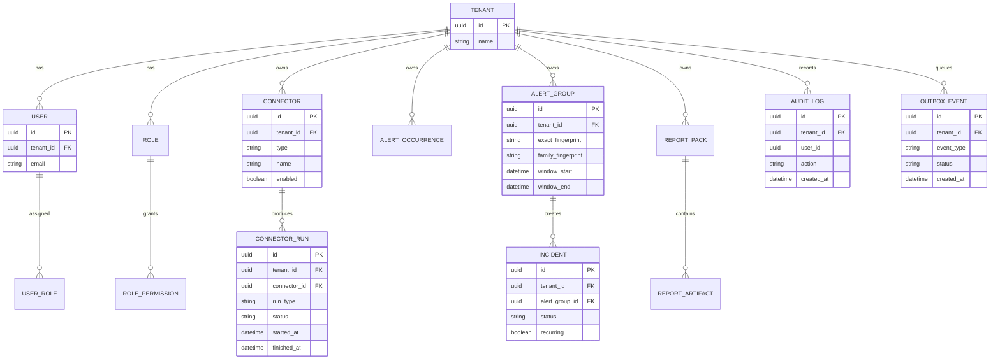
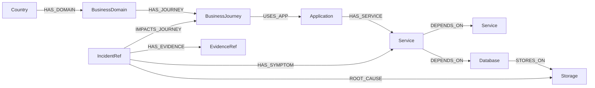

# Data Model (Logical)

This is a logical view to help readers. The physical schema is defined by Flyway migrations in `src/main/resources/db/migration/`.

> **Architecture authority:** [`docs/CAUSAL_PIPELINE.md`](./CAUSAL_PIPELINE.md). Every entity below must be `(tenant_id, country_code, environment)` scoped. Raw telemetry **never** lives in PostgreSQL or Neo4j — it goes to the Custom Index Engine (searchable) and object storage (`rawRef`). PostgreSQL holds canonical incidents, RCA results, evidence summaries, audit, and outbox.

## Core entities (PostgreSQL)

## Neo4j (hot graph)
- Nodes: `Country`, `BusinessDomain`, `BusinessJourney`, `Application`, `Service`, `ApiEndpoint`, `Server`, `Database`, `Storage`, `NetworkDevice`, `NetworkLink`, `ExternalSystem`, `Team`, `IncidentRef`, `AlertGroup`, `EvidenceRef`.
- Relationships: `HAS_DOMAIN`, `HAS_JOURNEY`, `USES_APP`, `HAS_SERVICE`, `DEPENDS_ON`, `STORES_ON`, `RUNS_ON`, `CONNECTED_BY`, `CALLS_EXTERNAL`, `OWNS`, `IMPACTS_JOURNEY`, `ROOT_CAUSE`, `HAS_SYMPTOM`, `HAS_EVIDENCE`.
- Neo4j is a **graph mirror** for topology + blast radius + causal paths. PostgreSQL remains the system of record for incidents.

## Hot state (Redis — DB 0 only)
Key-prefix isolation per country/environment — never logical DB > 0.

| Key pattern | Purpose | TTL |
|---|---|---|
| `dedup:{country}:{env}:{src}:{ci}:{code}` | Alert dedup (SETNX) | 10 min |
| `health:{country}:{env}:{kind}:{id}` | Hot health state | 5–15 min |
| `dashboard:{country}:{env}:{view}` | Dashboard cache | 30–60 s |
| `lock:{scope}:{id}` | Distributed lock | 30 s – 5 min |
| `rate-limit:tenant:{country}:{path}` | API rate limit | 60 s |
| `ai:summary:known-issue:{packHash}` | AI narrative cache | 1–6 h |
| `rca:evidence:{incidentId}` | EvidencePack short cache | 10–30 min |

## EvidencePack (AI input contract)
Built in-memory; **not** a Postgres entity. Persisted only via `incident.incident_evidence` summary and object storage (`rawRef`). Full shape and rules in [CAUSAL_PIPELINE §6](./CAUSAL_PIPELINE.md).

