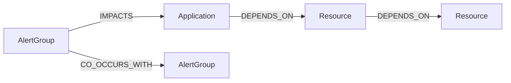

# Data Model (Logical)

This is a logical view to help readers. The physical schema is defined by Flyway migrations in `src/main/resources/db/migration/`.

## Core entities (PostgreSQL)

## Neo4j (hot graph)
- Nodes: Application, Resource, AlertGroup, Incident (optional)
- Relationships: DEPENDS_ON, IMPACTS, CO_OCCURS_WITH

