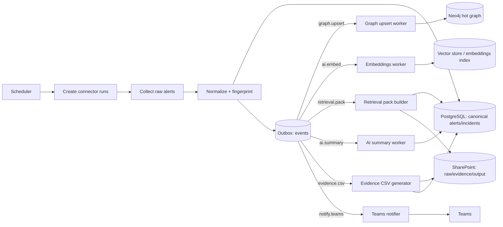
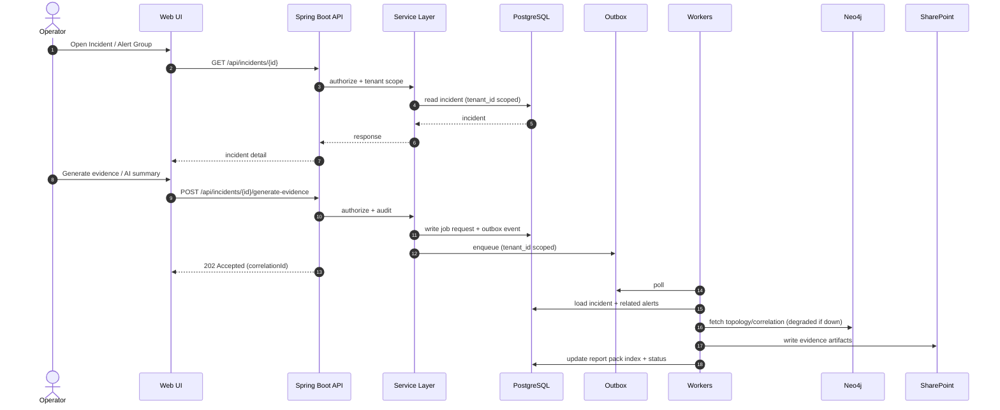

# System Flows (Mermaid)

> Evidence-first AI note: AI narratives must be derived from a retrieval/evidence pack. No invented facts.

## A) Hourly Scheduled Run (end-to-end)



## B) On-demand Investigation



## C) Write path invariants (must hold for every write)

```mermaid
flowchart TD
  REQ[HTTP request] --> H{Has X-Tenant-Id & X-User-Id?}
  H -- No --> DENY[Reject 400/401]
  H -- Yes --> AUTHZ{RBAC permission ok?}
  AUTHZ -- No --> FORBID[Reject 403]
  AUTHZ -- Yes --> AUDIT[Write audit log]
  AUDIT --> WRITE[Perform write (tenant scoped)]
  WRITE --> OUTBOX[Emit outbox event (if async)]
  OUTBOX --> RESP[Return response]
```
