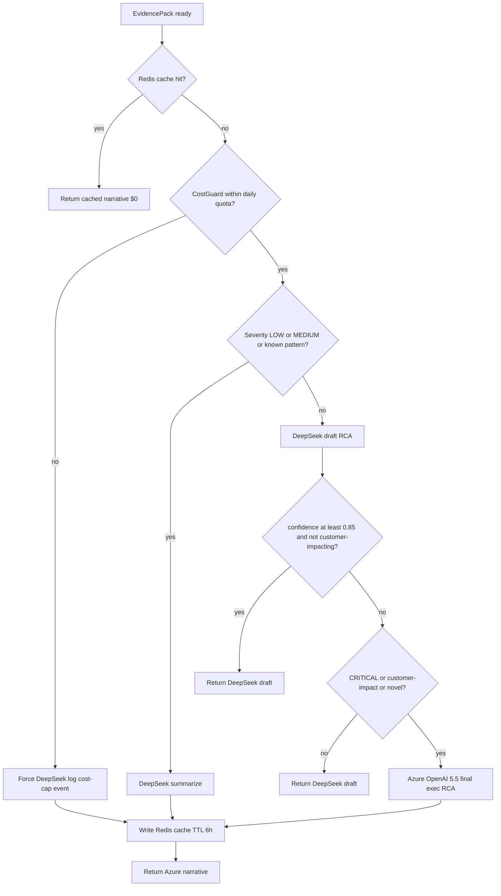
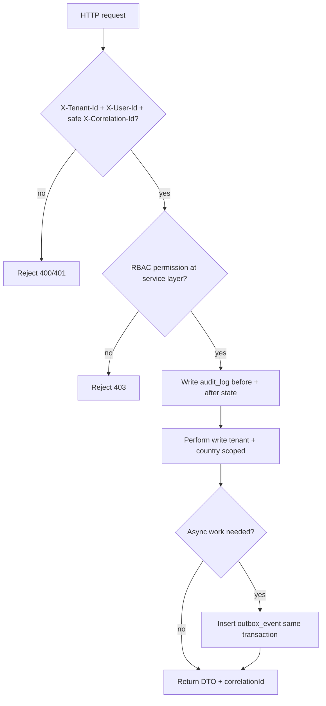
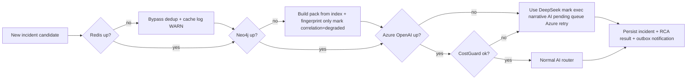
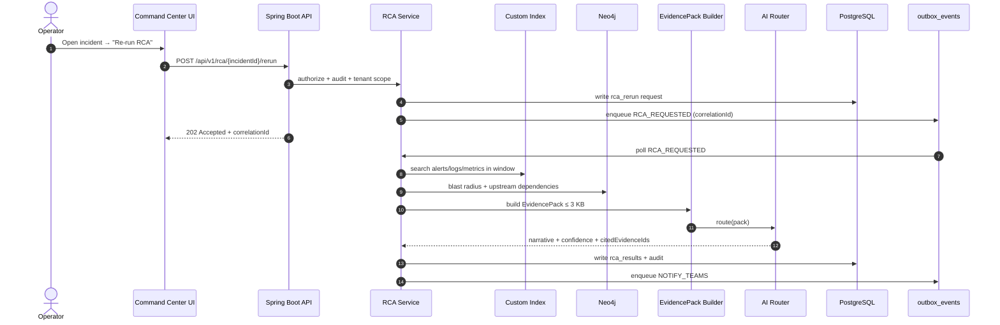
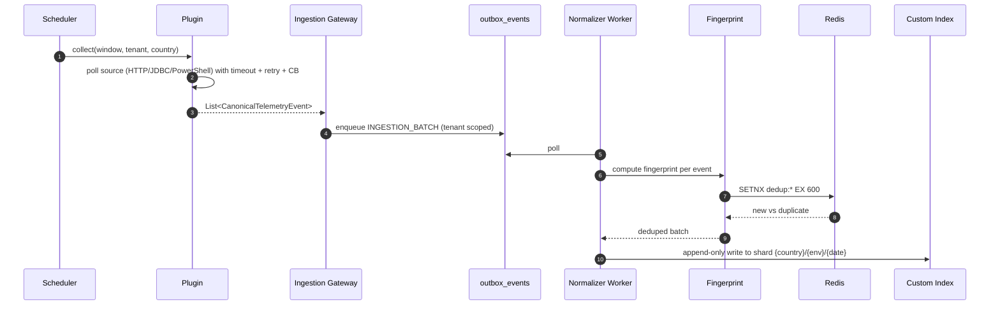

# System Flows (Mermaid)

> **Master design:** see [CAUSAL_PIPELINE](./CAUSAL_PIPELINE.md).
> Core rule for every diagram below: **Code finds the root cause. AI explains it.** AI never sees raw telemetry; only an `EvidencePack` (≤ 3 KB).

---

## A) Causal funnel — 100,000 alerts every 20 minutes

```mermaid
flowchart LR
  COL[Collectors / Plugins per country] --> ING[Ingestion Gateway]
  ING -->|tenant + country + schema validated| NORM[Normalizer + Enrichment]
  NORM -->|CanonicalTelemetryEvent| FP[Fingerprint sha256]
  FP -->|SETNX dedup:* EX 600| RDD[(Redis dedup)]
  FP -->|deduped batch| IDX[(Custom Index Engine shard per country/env/date)]
  IDX --> HS[Health State Engine]
  HS -->|health keys| RHS[(Redis hot state)]
  IDX --> TOPO[Neo4j Topology + Blast Radius]
  TOPO --> BIZ[Business-Journey Impact Filter]
  BIZ --> CAUS[Causal RCA Scoring 11 factors]
  CAUS --> PACK[EvidencePack Builder ≤ 3 KB]
  PACK --> AIC{Cache hit ai:summary:known-issue:hash?}
  AIC -- yes --> NARR[Reuse cached narrative $0 less than 1s]
  AIC -- no --> ROUTER[AI Router]
  ROUTER -->|low/med or known| DS[DeepSeek R1 local free]
  ROUTER -->|CRITICAL + customer impact + novel + exec| AOA[Azure OpenAI 5.5 paid]
  DS --> LCY[Incident Lifecycle Engine DETERMINISTIC]
  AOA --> LCY
  NARR --> LCY
  LCY -->|persist| PG[(PostgreSQL incident + rca_results)]
  LCY -->|mirror| TOPO
  LCY -->|outbox| NOTIF[Teams / Email / Webhook]

  classDef cost fill:#ffe5e5,stroke:#cc0000
  class AOA cost
```

**Reduction:** 100,000 raw → ~14k fingerprints → ~200 candidates → ~25 incidents → ~10 root-cause candidates → ~5 cache misses → **1–3 Azure calls per cycle**.

---

## B) AI Router decision

Every decision is audited with `model`, `reason`, `tokens`, `cost`, `confidence`, `correlationId` (see [CAUSAL_PIPELINE §5](./CAUSAL_PIPELINE.md)).

---

## C) Write-path invariants (every write)

---

## D) Degraded-mode flow (AI / Neo4j / Redis down)

---

## E) On-demand investigation (operator triggers re-analysis)

---

## F) Connector run (collect → queue)

---

Diagrams complement, never replace, the [CAUSAL_PIPELINE](./CAUSAL_PIPELINE.md) numbers and `EvidencePack` contract.

