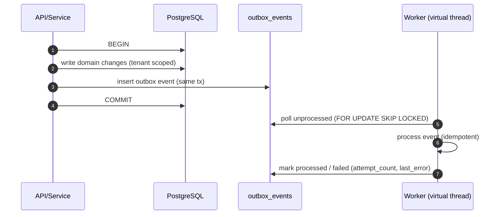

# Outbox Pattern

> Aligned to the [Causal Funnel Pipeline](./CAUSAL_PIPELINE.md). Every async step in the funnel goes through the outbox so the platform survives Neo4j / Redis / DeepSeek / Azure OpenAI outages.

## Why
The funnel never blocks a user request on AI or external IO. PostgreSQL transactions atomically persist domain changes **plus** an `outbox_event` row; background workers drain the outbox on virtual threads. This gives us at-least-once delivery, full audit trail, and clean degraded-mode behavior.

## Tables
- `ops.outbox_events` — platform-wide async events (Flyway `V1__init_aiops_schema.sql`).
- `config.outbox_events` — connector operations (Flyway `V2__add_connector_plugins.sql`).

Both carry `tenant_id`, `country_code`, `environment`, `correlation_id`, `event_type`, `payload_json`, `created_at`, `processed_at`, `attempt_count`, `last_error`.

## Rules
1. Every outbox row is `(tenant_id, country_code, environment)` scoped.
2. Every row carries `correlation_id` for end-to-end tracing.
3. Workers must be **idempotent** — events may be redelivered.
4. Workers run on **virtual threads** (`Executors.newVirtualThreadPerTaskExecutor()`).
5. Workers must respect `Resilience4j` circuit-breakers when calling external IO (Azure OpenAI, DeepSeek, Teams, vendor APIs).
6. **No secrets, tokens, credentials, or raw PII in `payload_json`.** Pass IDs and let the worker reload from the encrypted source of truth.
7. Failed events: exponential backoff, max attempts, then `DLQ` table for operator review.
8. The outbox is the **only** way AI work is dispatched — never in the request thread.

## Typical lifecycle

## Funnel-aligned event types

| Event | Producer | Worker | Notes |
|---|---|---|---|
| `INGESTION_BATCH_RECEIVED` | Ingestion Gateway | Normalizer | Carries object-storage `rawRef`, never raw payload. |
| `TELEMETRY_NORMALIZED` | Normalizer | Fingerprint + Index writer | Batched event references. |
| `INDEX_WRITE_REQUESTED` | Fingerprint worker | Custom Index Engine writer | Carries shard key + doc count. |
| `TOPOLOGY_UPSERT_REQUESTED` | Normalizer | Neo4j upsert worker | CMDB sync + dependency edges. |
| `HEALTH_STATE_UPDATE` | Normalizer / scoring | HealthStateService | Updates Redis `health:*` keys. |
| `RCA_EVIDENCE_REQUESTED` | Business-impact filter | `EvidencePackBuilder` | Triggers Stage 6. |
| `AI_NARRATIVE_REQUESTED` | EvidencePackBuilder | `AiRouter` | Stage 8 — cache → DeepSeek → Azure. |
| `AI_NARRATIVE_RETRY` | AiRouter (Azure CB open / CostGuard tripped) | AiRouter | Backoff retry against Azure when window opens. |
| `INCIDENT_OPEN_REQUESTED` | RCA service | `IncidentLifecycleEngine` | Deterministic state machine. |
| `INCIDENT_TRANSITION_REQUESTED` | Lifecycle engine | Lifecycle engine | Open / Ack / Monitor / Close / Reopen. |
| `EVIDENCE_PERSIST_REQUESTED` | Lifecycle engine | Evidence writer | Saves to `incident.incident_evidence` + object storage. |
| `NOTIFY_TEAMS` / `NOTIFY_EMAIL` / `NOTIFY_WEBHOOK` | Lifecycle engine | `notification.*` | Carries incident ID + correlation only. |
| `CONNECTOR_TEST_REQUESTED` | Settings / Connectors UI | Plugin tester | Used by Settings test flow. |
| `CONNECTOR_COLLECT_REQUESTED` | Scheduler | Plugin executor | Periodic collection. |

## Degraded-mode behavior
- **Azure OpenAI CB open or CostGuard tripped** → `AI_NARRATIVE_RETRY` queued with exponential backoff (max 6 attempts, then mark incident `aiNarrative=PENDING` and notify with DeepSeek draft only).
- **Neo4j down** → `TOPOLOGY_UPSERT_REQUESTED` keeps queuing; RCA marks `correlation=degraded`.
- **Redis down** → `HEALTH_STATE_UPDATE` is dropped (hot cache only); ingestion still succeeds.
- **Custom Index down** → `INDEX_WRITE_REQUESTED` keeps queuing; ingestion never blocks.

## Related
- [CAUSAL_PIPELINE](./CAUSAL_PIPELINE.md) §11 (degraded modes), §5 (AI router).
- [ARCHITECTURE](./ARCHITECTURE.md) — component view.
- [FLOWS](./FLOWS.md) — Mermaid funnel + AI router decision + degraded-mode flow.

