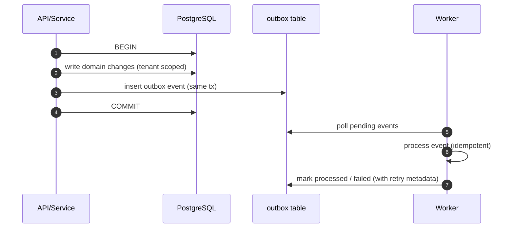

# Outbox Pattern

## Why
We use the outbox pattern to ensure reliable async processing (AI jobs, evidence generation, scheduled runs, notifications) without losing events when a transaction commits but a worker fails.

## Rules
- Every outbox record is tenant-scoped (`tenant_id`).
- Every outbox record includes `correlation_id` for traceability.
- Workers must be idempotent (safe to retry).
- Writes must be audited (who/what/when).

## Typical lifecycle

## Event types (examples)
- `CONNECTOR_TEST_REQUESTED`
- `CONNECTOR_COLLECT_REQUESTED`
- `GRAPH_UPSERT_REQUESTED`
- `AI_EMBEDDINGS_REQUESTED`
- `RETRIEVAL_PACK_REQUESTED`
- `EVIDENCE_PACK_REQUESTED`
- `TEAMS_NOTIFICATION_REQUESTED`
