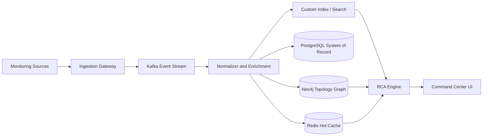
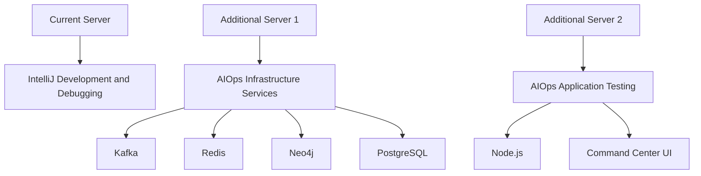

# AIOps Project — Server and Tool Flowchart

> Short flowchart document for requesting additional testing server capacity for the AIOps project beside the current development server.

---

## AIOps Project

### Flowchart

### Tools Usage

| Tool | Business Usage |
|---|---|
| **IntelliJ** | Used by developers to build, run, and test the AIOps application safely before release. |
| **Kafka** | Ensures alerts and monitoring events are received and processed continuously without losing important operational information. |
| **Redis** | Makes dashboards and current health status faster, helping operations teams see issues quickly. |
| **Neo4j** | Shows how applications, services, databases, servers, storage, and network devices are connected, so teams can understand business impact and root cause. |
| **Node.js** | Supports the Command Center user interface used by operations teams to view dashboards, incidents, RCA, and reports. |
| **PostgreSQL** | Stores official business records such as users, incidents, audit history, configuration, workflow status, and RCA summaries. |

---

## Recommended Server Split

| Server | Purpose |
|---|---|
| **Current Server** | IntelliJ development, code build, and debugging. |
| **Additional Server 1** | AIOps infrastructure services such as Kafka, Redis, Neo4j, and PostgreSQL. |
| **Additional Server 2** | AIOps application and Command Center testing with Node.js/UI support. |

## Short Justification

One server is not enough to run the AIOps application and all required supporting tools together. Separating the AIOps services from application testing will reduce resource conflicts, port conflicts, and performance issues, while improving development and testing speed.

